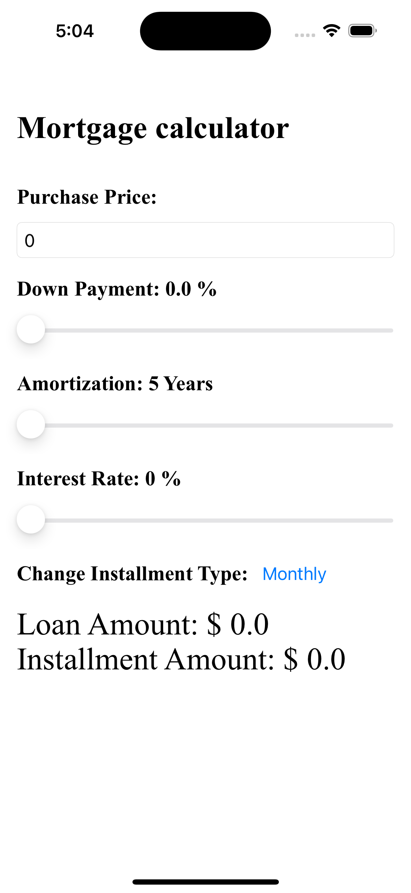
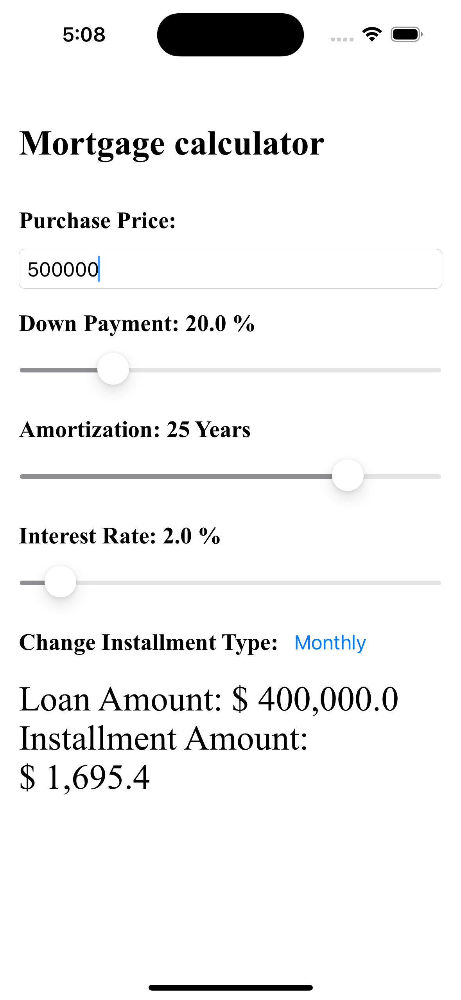
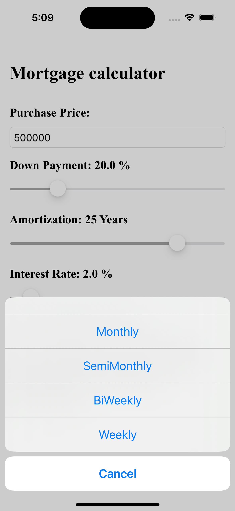

# Mortgage Calculator

This is a Mortgage Calculator iOS application built using SwiftUI. It allows users to calculate their mortgage payments based on their inputs such as the home price, down payment, payment frequency, interest rate, and loan term.

## Features

-   Simple and intuitive user interface
-   Calculation of monthly mortgage payment based on user inputs

## Requirements

-   iOS 16 or higher
-   Xcode 14.0.1 or higher
-   Swift 5 or higher

## Installation

1.  Clone the repository
2.  Open the `MortgageCalculator.xcodeproj` file in Xcode
3.  Build and run the application

## Credits

This application was developed by Binal Ahiya. If you have any questions or feedback, please contact me at ahiyabinal@gmail.com.

## License

This application is licensed under the [GPL 3.0 License](https://github.com/AhiyaBinal/MortgageCalculator/blob/main/LICENSE). You are free to use, modify, and distribute this application as you see fit.

## Screen Prints  

